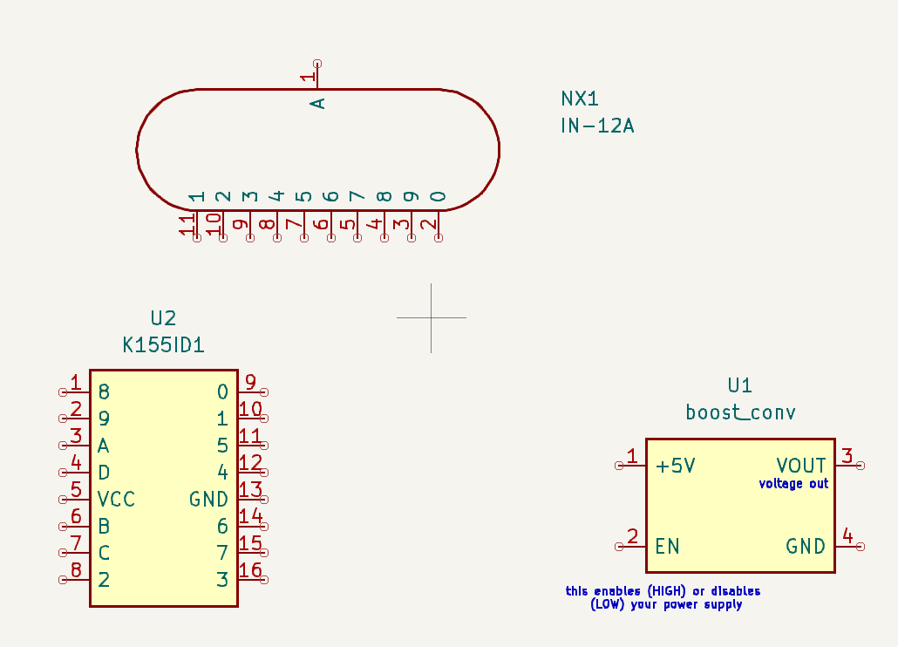

# Journal
## Thursday, June 5 2025 (~3 hours spent)
I've been deciding between a couple projects for some time, and finally decided to commit to a nixie tube clock. I talked to Alex Park a ton about [his clock](https://parkalex.dev/posts/nixieclock) 
that he made in january, and he gave me a ton of advice. I searched around for other clocks people have made and have boiled my BOM to 6 items:             
- x6 IN-12 nixie tubes
- x6 K155ID1 controller chips
- x1 6V to 170V boost controller power supply
- x1 Raspberry pi pico W
- x4 AA Batteries (+ 1 case)
- x1 PCB and shipping

This isn't counting some resistors and capacitors I'll need, but I'll research those later. The K1551D1 is a chip made for controlling nixie tubes (and alex used it so I'm
copying him) I chose the pico W because it has RTC, a bunch of GPIO pins (you need 25 for a 6-digit nixie clock), and it's WiFi enabled. The total is around $70, which is
completely doable. I'm excited. I'm kinda afraid of shocking myself, but it'll probably be okay.

## Friday, June 6 2025 (5 hours spent)
I had to find a boost converter that could be bought in bulk and tried to find
KiCAD footprints (I'd already resigned to making the symbols myself) but none of them are named???? Like not a single boost converter I found that can get up to the 170V needed
for 6 IN-12 tubes have names. No part number, just "3V-6V to 170V Boost Converter Nixie Power Supply 6pcs 12pcs Very Cheap Awesome Good Quality". So, yeah great.

 
Then, I made the project in KiCAD (DeLorean, there's probably a wittier name but whatever) and got to work making the boost converter, K155ID1, and IN-12 nixie tube symbols since
apparently, even though tons of people make these clocks and they sell for like $300 on amazon, I'm too blind to find a good one on the internet. And it doesn't help that the
datasheets for these look like they haven't been updated since the Russians made these things back in the cold war.           

 
I have to order one of the boost controllers so I can make a footprint for it (again, it doesn't have a name and kinda seems like it doesn't exist outside of aliexpress and
ebay, am I doing something wrong?), but it won't arrive until I'm in vermont in 2 weeks, so I'll have to wait till then to make it (I tried to look around for more in-depth
dimensions but no luck). 
