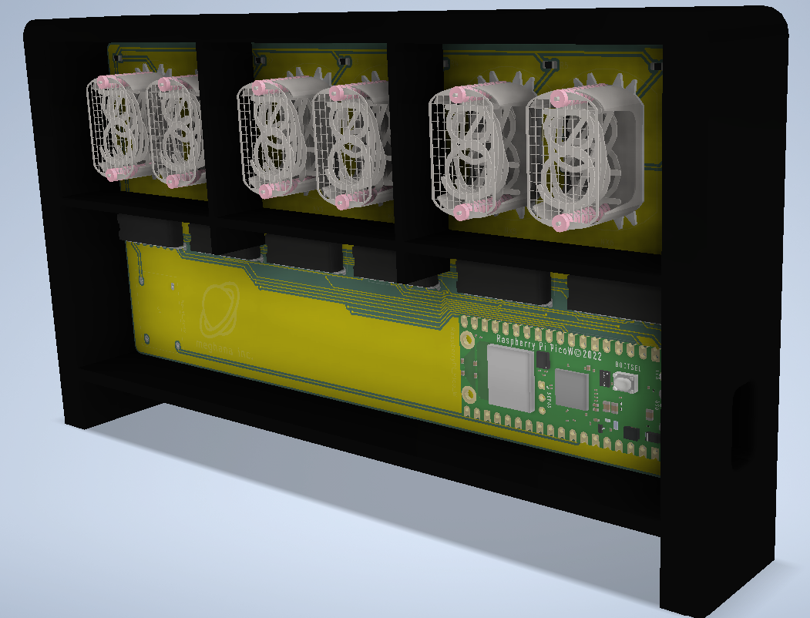

# delorean
A super cool nixie clock made with a custom PCB powered by a raspberry pi pico W.
## Why
I recently discovered nixie tubes and was like "I should totally make something with that". I wanted to make something a bit more complicated for my first go, but this clock sets me up pretty well do to some cooler stuff (and will make for a pretty awesome present).         

## Case + Board
I've been trying to get better at Inventor (people keep shaming me for using Fusion, so), and this project was a good way to ease back into it. I was also painfully reminded of how hard it is to CAD without a mouse.

    

## PCB
This is my 3rd PCB, and while it took a lot less time than my first, it was still a hassle to route all those nixie tubes. Pretty happy with the way it turned out, and might have to add some more silkscreen stuff to it.

    
      

## Design Process
If you want to learn how I'm making this, check out the [journal](/JOURNAL.md)

## BOM
| Item | Qty | Cost/item | Total Cost |
| ---- | --- | --------- | ---------- |
| IN-12 nixie tubes | 6 | $5.08 | $30.50 |
| K155ID1 controller chip | 6 | $1 | $6 |
| 5V to 170V boost converter | 1 | 10.50 | $10.50 |
| Raspberry Pi Pico W | 1 | $7.65 | $7.65 |
| DIP-16 chip connecter | 6 | $0.25 |$1.50 |
| Custom PCB from JLCPCB | 1 | ~$10 | ~$10 |
| USB Isolator | 1 | $9.99 | $9.99 | 
| USB A to C | 1 | $1.29 | $1.29 | 
| Estimated shipping |  |  | $15 |
| Total |  |  | ~$95 |

View the full BOM [here](https://docs.google.com/spreadsheets/d/1stNW1CtxRqX0r_00TOh1KZHbPOv3G7_He01Eiyjgmc0/edit?usp=sharing)
